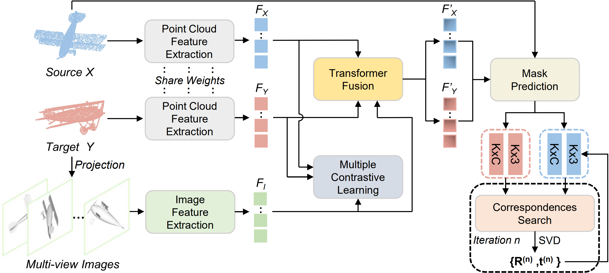

# Cross-Modal Information-Guided Network using Contrastive Learning for Point Cloud Registration (RAL 2023)
PyTorch implementation of the paper:
[Cross-Modal Information-Guided Network using Contrastive Learning for Point Cloud Registration]([https://arxiv.org/abs/](https://arxiv.org/abs/2311.01202)).




## Environment
Our model is trained with the following environment:
- Ubuntu 20.04
- Python 3.8
- PyTorch 1.8.1 with torchvision 0.9.1 (Cuda 11.1)
Other required packages can be found in ```requirements.txt```.

## Dataset Preparation
The cross-modal ModelNet40 dataset can be downloaded from [Google Drive](https://drive.google.com/file/d/1O-CeBMMZloQnYeDeHyAcPL8wnCEcL1HB/view?usp=sharing). You can download and unzip it to the ```data``` folder. 

The pre-trained models can be downloaded from [Google Drive](https://drive.google.com/file/d/1t5kJPBoRUaQebqhJhMBwqEUcrPWfu2Wd/view?usp=sharing).


## Usage
You can see a list of options that can be used to control hyperparameters of the model and experiment settings at the end of ```main.py```. The comments in the file should be enough to understand them.

To train a model:
```
python main.py 
```

To test a model:
```
python test.py --model_path <path_to_model>
```

## Usage
Our code is released under MIT License (see LICENSE file for details).


<!-- ## Citation
If you find our work useful in your research, please consider citing:
```latex
@article{xie2023cmignet,
  title={Cross-Modal Information-Guided Network using Contrastive Learning for Point Cloud Registration},
  author={Yifan Xie, Jihua Zhu, Shiqi Li, Pengcheng Shi},
  journal={IEEE Robotics and Automation Letters},
  year={2023}
}
``` -->
